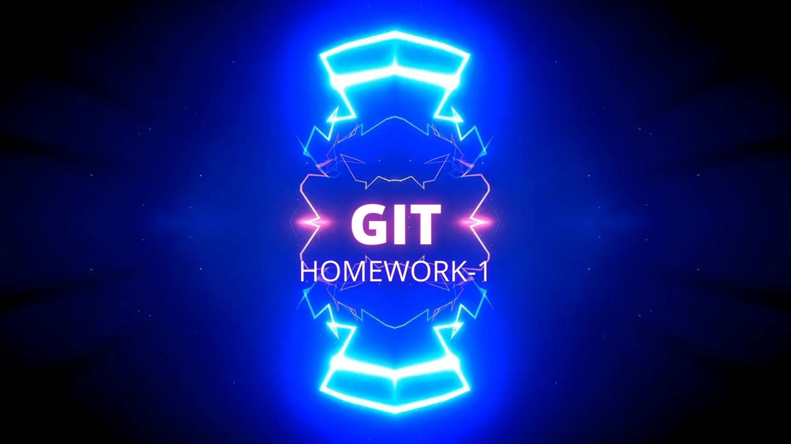

# GIT INTRO
___
---

***
| **Основные команды Git:**        | *Их назначение*                        |
| -------------------------------- | ---------------------------------- |
| 1. ***git init***                | инициализация локального репозитория                        |
| 2. ***git status***              | получить информацию о гит и его текущем состоянии                  |
| 3. ***git add***                 | добавить файлы в следующем коммите                            |
| 4. ___git commit -m 'message'___ | создание коммита                            |
|5. ***git log***|выводит на экран историю всех коммитов с их хэш-кодами                         |
|6. ***git checkout***|переход с одного комита на другой                   |
|7. ***git checkout master***      |вернуться к актуальному состиоянию и продолжить работу                  |
|8. ***git diff***| увидеть разнтцу между текущим файлом и закоммиченым файлом                             |
------------------------------------
------------------------------------

## Git intro part 2
---
***
>***git reset HEAD~*** - отмена последнего коммита 

>***git branch*** - позволяет создавать, просматривать, переименовывать и удалять ветки

>***git config --global --reset-all user.name*** - изменение настройки глобал, например имени

